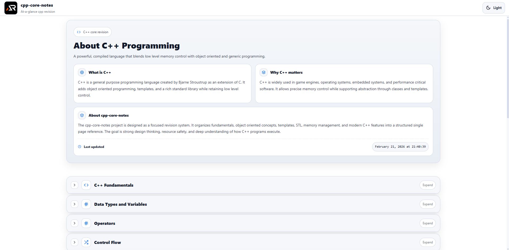

# C++ Core Notes

A single-page, at-a-glance revision project for core C++ programming concepts.

This project is designed as a fast reference and structured summary sheet covering essential C++ topics without unnecessary depth.  
It focuses on clarity, object-oriented thinking, memory management, STL usage, and practical modern C++ fundamentals for beginners and interview revision.

---



---

## Purpose

- Quick revision before interviews
- Rapid recall of C++ syntax and object-oriented concepts
- Clear mental model of memory, objects, and resource management
- Practical reminders for writing safe and modern C++
- Strong foundation for DSA, competitive programming, and system-level development

## Coverage

- C++ basics and program structure
- Compilation process and build flow
- Namespaces and standard library overview
- Variables, constants, and data types
- Type casting and const correctness
- Operators and expressions
- Control flow - if else switch loops break continue
- Functions - overloading, inline, default arguments, recursion
- Arrays, strings, vector, and basic containers
- Pointers and references
- Dynamic memory - new delete
- Object oriented programming - classes, objects, encapsulation
- Constructors and destructors
- Inheritance and polymorphism
- Virtual functions and dynamic binding
- Copy constructor and move constructor
- Rule of Three Five Zero
- Templates - function and class templates
- STL - containers, iterators, algorithms
- Lambda expressions
- Exception handling - try catch throw
- File handling with fstream
- Smart pointers - unique_ptr shared_ptr weak_ptr
- RAII concept
- Basic concurrency - std::thread and mutex
- Common pitfalls and best practices

## Tech Stack

- React
- Vite
- styled-components

## Project Type

Single page only  
Section-based navigation  
Searchable and expandable content  
No blog-style content, only structured notes

Each topic is modular and collapsible for fast scanning.

## Run Locally

```bash
npm install
npm run dev
```

---

### Build

```bash
npm run build
```

---

### Goal

Complete core C++ knowledge in one scrollable page.
No fluff. No repetition. Just essentials.
